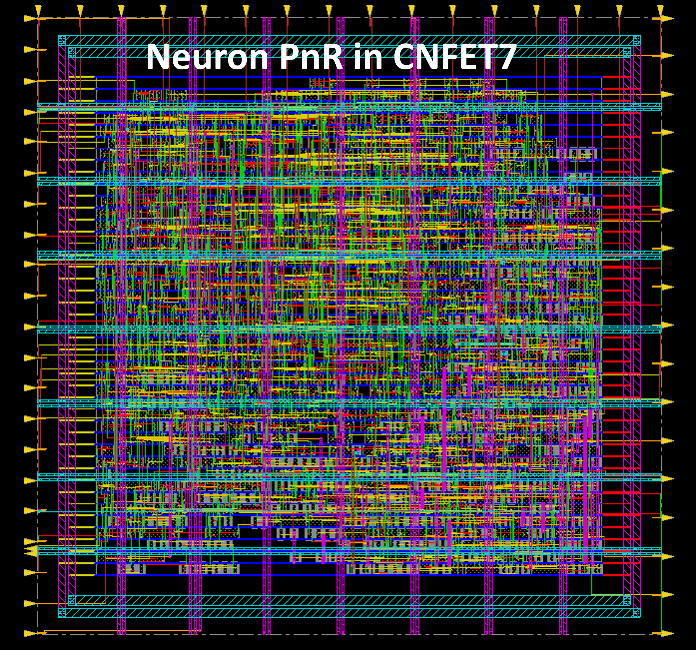
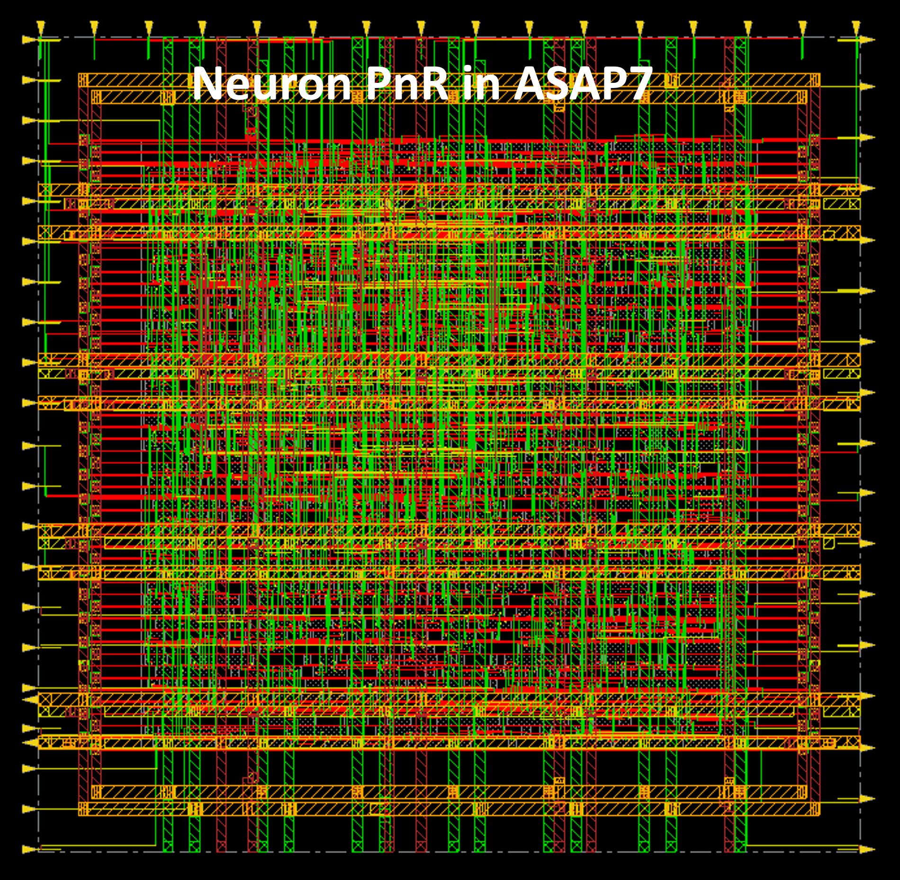
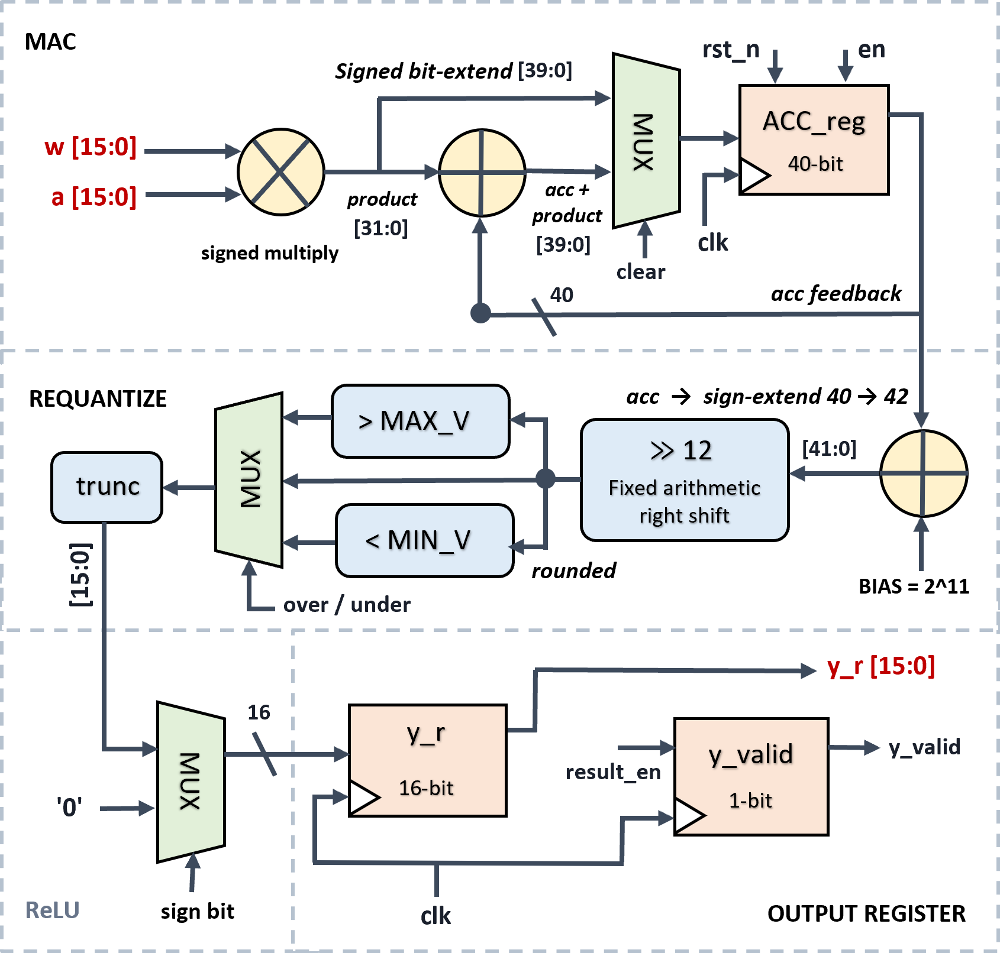
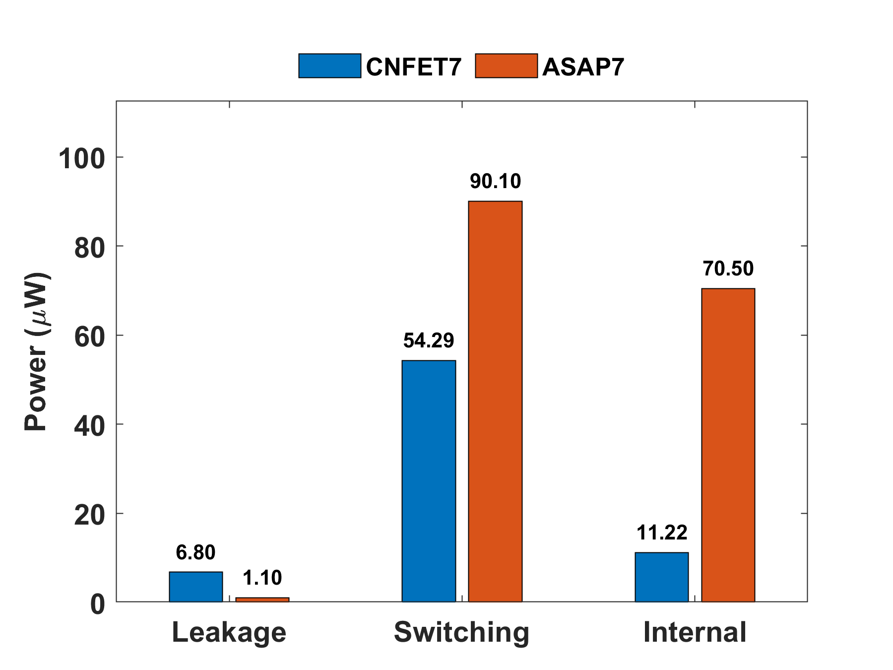
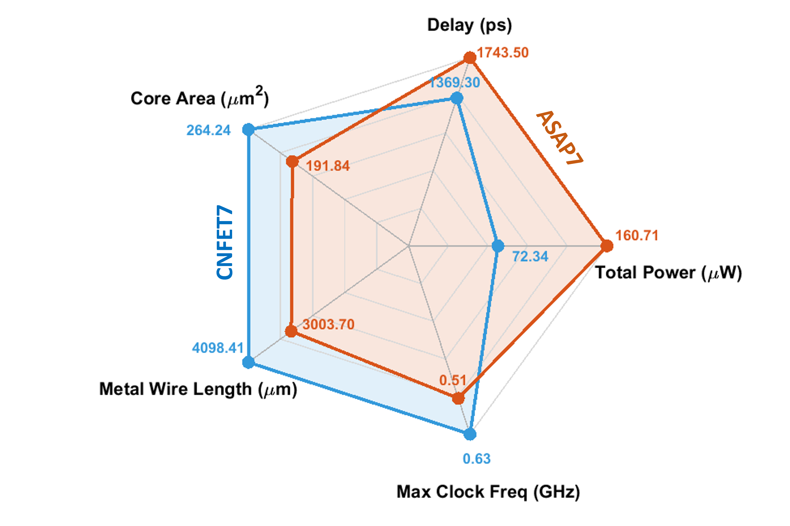

# CNFET7 CNN Neuron — 7-nm CNFET vs FinFET

A 16-bit quantized convolutional neuron carried through a complete timing-driven RTL-to-GDSII flow in two open 7-nm predictive technologies, **CNFET7** and the **ASAP7 FinFET PDK**, under an identical RTL and synthesis constraint.

**Paper:** *A CNN Neuron for Always-On Near-Sensor Inference Based on 7-nm CNFET*

**Role (co-first author):** literature review, neuron architecture design, RTL implementation, synthesis through place-and-route, and timing closure.

   

## Results

Post-route, at matched activity factor and clock, CNFET7 against ASAP7:

| Figure of merit | CNFET7 | ASAP7 | Ratio | |
|---|---|---|---|---|
| Critical-path delay (ps) | 1369.3 | 1743.5 | 0.79 | −21.5% delay |
| Total power (µW) | 72.34 | 160.71 | 0.45 | −55.0% power |
| Power–delay product (fJ) | 99.06 | 280.20 | 0.35 | 2.8× advantage |
| Energy–delay product (fJ·ps) | 135.6×10³ | 488.5×10³ | 0.28 | 3.6× advantage |
| Core area (µm²) | 264.24 | 191.84 | 1.38 | +37.7% area |

- **1.24× frequency** headroom (0.63 GHz vs 0.51 GHz).
- Dynamic power drops **59.2%**: internal power −84%, switching −40%; leakage rises 1.1 → 6.8 µW.

## The neuron

A single time-multiplexed neuron, chosen over a parallel array so low standby leakage dominates at the long inter-inference intervals of always-on sensing.

- Signed 16-bit MAC into a **40-bit accumulator** — 8 guard bits above the 32-bit product, covering 256 accumulation terms without silent overflow.
- Per-layer **Q4.12 fixed-point requantization**: round-to-nearest via a 2^(s-1) bias evaluated two bits wider than the accumulator so the bias cannot overflow, plus saturation to the output range.
- **ReLU** as a single sign-bit multiplexer, latched to the output register on a `result_en` strobe with a single-cycle `y_valid` handshake.
- Target 3 ns (333 MHz), typical corner, 60% utilization; VDD 0.4 V (CNFET7) / 0.7 V (ASAP7).

## Method

Nine-stage flow in Cadence — RTL → synthesis → floorplan → pin placement → power mesh → PnR → CTS → NanoRoute → signoff — with congestion and timing re-checked at every stage. Flow, scripts, and constraints are identical across the two technologies; only the technology collateral and supply voltage differ, so every difference in the results is attributable to the device.

## Main findings

The 37.7% area and 36.4% wire penalties are **not** a device property. Normalized per instance, CNFET7 cells are **17.1% smaller** and use **18.2% less routed wire** than ASAP7. The penalty is entirely an instance-count effect: CNFET7 needs **66.7% more cells**, driven by its 56-cell library against ASAP7's 195 — an X2 combinational drive ceiling, no native enable flop, and no complex/full-adder cells. It is a library-maturity gap, expected to close as coverage matures. Separately, CNFET7 presents ~13% less effective switched capacitance despite the extra instances and wire — direct block-level evidence of the intrinsic device capacitance advantage.

## Images

**Neuron layout — CNFET7 (left) vs ASAP7 (right)**

  
  

**Neuron microarchitecture**

  

**PPA comparison**

  
  

